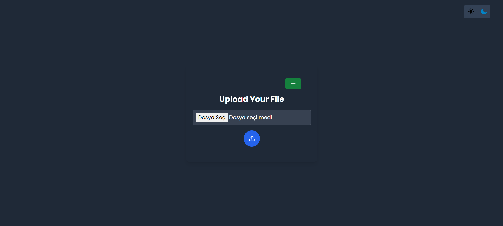
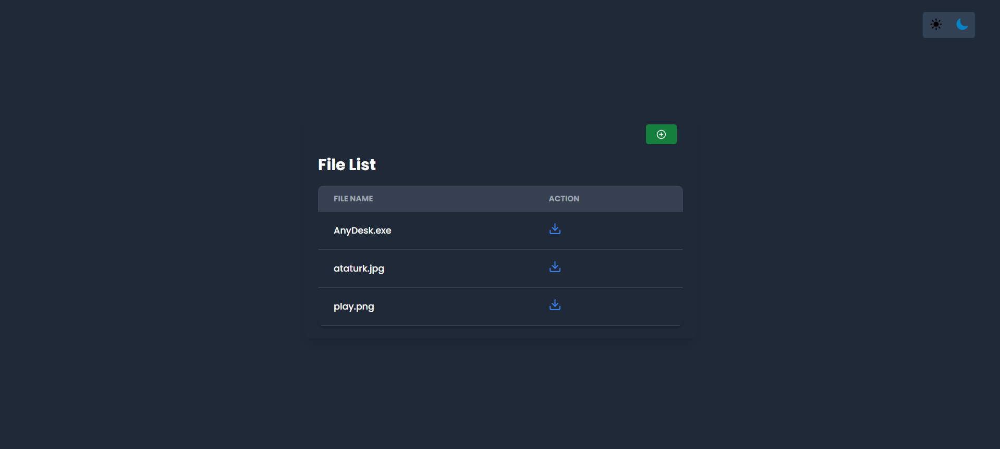

## 📂 `File Sharing`

<br>

<div align="center">
<h3>⚡Upload</h3>

<h3>⚡List</h3>

</div>

<br>

- ✅ File sharing application running on Ubuntu server.

<br>

<br>

Used Technologies in The Project:

[](https://www.java.com/en/)
[](https://spring.io/)
[](https://maven.apache.org/)
[](https://react.dev/)
[](https://axios-http.com/docs/intro)
[](https://tailwindcss.com/)
[](https://docs.docker.com/)
[](https://ubuntu.com/server)

<br>

### Installation

```bash
git clone https://github.com/furkankayam/file-share.git
```

<br>

### Editing Config

- file-share/frontend/config.js

```bash
// Backend App URL
export const API_URL = "http://<ubuntu_server_ip>:8080";
```

<br>

### Usage

```bash
docker-compose up -d
```

<br>

### URL

```bash
http://<ubuntu_server_ip>:5173
```

<br>

<br>

# License

This project is licensed under the MIT License. See the [LICENSE](LICENSE) file for details

Created by [Mehmet Furkan KAYA](https://www.linkedin.com/in/mehmet-furkan-kaya/)
